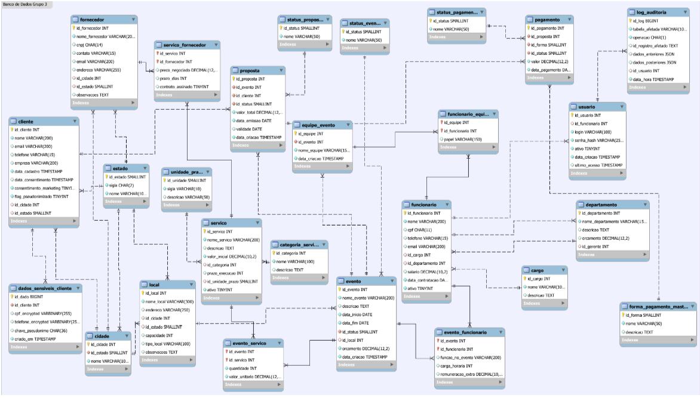

# Banco de Dados — Grupo 3
## Refatoração do Modelo Lógico & Implementação do Controle de Usuários

---

## 1. Objetivos da Atividade

- **Refatoração:** Aplicar todas as correções e sugestões do feedback da avaliação anterior ("Projeto - Geração do Modelo Lógico"), revisando tabelas, colunas, chaves primárias, estrangeiras e tipos de dados.
- **Controle de Usuários:** Integrar o sistema de cadastro e controle de usuários apresentado em aula, adaptando-o ao contexto do projeto.
- **Script DDL para PostgreSQL:** Gerar o script DDL completo e convertê-lo do dialeto MySQL para PostgreSQL com auxílio de IA, revisando o resultado para garantir corretude.

---

## 2. Diagrama do Modelo Lógico



> O diagrama acima representa o modelo lógico do schema `evento_manager`, contendo todas as tabelas, relacionamentos e chaves do projeto após refatoração.

---

## 3. Protocolo de Execução

1. **Refatoração do Modelo Lógico:** Revisão das tabelas com base exclusivamente no feedback da avaliação anterior — correção de tipos de dados, nomenclatura de colunas, chaves primárias e estrangeiras.
2. **Implementação do Controle de Usuários:** Integração das tabelas `usuario` e `log_auditoria` ao modelo, adaptadas ao contexto de gerenciamento de eventos.
3. **Conversão para PostgreSQL:** Utilização de IA (ChatGPT/Gemini) para converter o script MySQL gerado pelo MySQL Workbench para o dialeto PostgreSQL, seguida de revisão manual pelo grupo.

---

## 4. Estrutura do Schema `evento_manager`

### Tabelas de Domínio / Lookup

| Tabela | Descrição |
|---|---|
| `status_evento` | Estados possíveis de um evento |
| `status_proposta` | Estados possíveis de uma proposta |
| `status_pagamento` | Estados possíveis de um pagamento |
| `categoria_servico` | Categorias dos serviços oferecidos |
| `unidade_prazo` | Unidades de medida de prazo (dias, semanas etc.) |
| `forma_pagamento_master` | Formas de pagamento aceitas |
| `cargo` | Cargos dos funcionários |
| `estado` | Estados brasileiros (sigla + nome) |

### Tabelas Geográficas

| Tabela | Descrição |
|---|---|
| `cidade` | Cidades vinculadas a estados |
| `local` | Locais de realização dos eventos |

### Tabelas de Pessoas e Organização

| Tabela | Descrição |
|---|---|
| `cliente` | Cadastro de clientes com consentimento LGPD |
| `dados_sensiveis_cliente` | CPF e telefone criptografados (LGPD) |
| `funcionario` | Cadastro de funcionários |
| `departamento` | Departamentos com gerente referenciado |

### Tabelas Operacionais

| Tabela | Descrição |
|---|---|
| `evento` | Eventos com status, local e orçamento |
| `servico` | Serviços com categoria e prazo de execução |
| `fornecedor` | Fornecedores com CNPJ e localização |
| `proposta` | Propostas vinculadas a eventos e clientes |
| `pagamento` | Pagamentos vinculados a propostas |

### Tabelas de Relacionamento (N:N)

| Tabela | Relacionamento |
|---|---|
| `evento_servico` | Evento ↔ Serviço (com quantidade e valor unitário) |
| `evento_funcionario` | Evento ↔ Funcionário (com função e remuneração extra) |
| `servico_fornecedor` | Serviço ↔ Fornecedor (com preço negociado e contrato) |
| `equipe_evento` | Equipes vinculadas a eventos |
| `funcionario_equipe` | Funcionário ↔ Equipe (com papel) |

### Tabelas de Controle de Usuários e Auditoria

| Tabela | Descrição |
|---|---|
| `usuario` | Usuários do sistema vinculados a funcionários |
| `log_auditoria` | Registro de operações com dados anteriores e posteriores em JSON |

---

## 5. Script DDL Completo — MySQL (Original)

```sql
-- MySQL Script generated by MySQL Workbench
-- Model: evento_manager | Version: 1.0

SET @OLD_UNIQUE_CHECKS=@@UNIQUE_CHECKS, UNIQUE_CHECKS=0;
SET @OLD_FOREIGN_KEY_CHECKS=@@FOREIGN_KEY_CHECKS, FOREIGN_KEY_CHECKS=0;
SET @OLD_SQL_MODE=@@SQL_MODE,
    SQL_MODE='ONLY_FULL_GROUP_BY,STRICT_TRANS_TABLES,NO_ZERO_IN_DATE,
              NO_ZERO_DATE,ERROR_FOR_DIVISION_BY_ZERO,NO_ENGINE_SUBSTITUTION';

CREATE SCHEMA IF NOT EXISTS `evento_manager`
  DEFAULT CHARACTER SET utf8mb4
  COLLATE utf8mb4_0900_ai_ci;
USE `evento_manager`;

-- Tabelas de Domínio
CREATE TABLE IF NOT EXISTS `status_evento` (
  `id_status` SMALLINT NOT NULL,
  `nome`      VARCHAR(50) NOT NULL,
  PRIMARY KEY (`id_status`),
  UNIQUE INDEX (`nome` ASC)
) ENGINE = InnoDB;

CREATE TABLE IF NOT EXISTS `status_proposta` (
  `id_status` SMALLINT NOT NULL,
  `nome`      VARCHAR(50) NOT NULL,
  PRIMARY KEY (`id_status`),
  UNIQUE INDEX (`nome` ASC)
) ENGINE = InnoDB;

CREATE TABLE IF NOT EXISTS `status_pagamento` (
  `id_status` SMALLINT NOT NULL,
  `nome`      VARCHAR(50) NOT NULL,
  PRIMARY KEY (`id_status`),
  UNIQUE INDEX (`nome` ASC)
) ENGINE = InnoDB;

CREATE TABLE IF NOT EXISTS `categoria_servico` (
  `id_categoria` INT NOT NULL AUTO_INCREMENT,
  `nome`         VARCHAR(100) NOT NULL,
  `descricao`    TEXT NULL DEFAULT NULL,
  PRIMARY KEY (`id_categoria`),
  UNIQUE INDEX (`nome` ASC)
) ENGINE = InnoDB;

CREATE TABLE IF NOT EXISTS `unidade_prazo` (
  `id_unidade` SMALLINT NOT NULL,
  `sigla`      VARCHAR(10) NOT NULL,
  `descricao`  VARCHAR(50) NULL DEFAULT NULL,
  PRIMARY KEY (`id_unidade`),
  UNIQUE INDEX (`sigla` ASC)
) ENGINE = InnoDB;

CREATE TABLE IF NOT EXISTS `forma_pagamento_master` (
  `id_forma`  SMALLINT NOT NULL,
  `nome`      VARCHAR(50) NOT NULL,
  `descricao` TEXT NULL DEFAULT NULL,
  PRIMARY KEY (`id_forma`),
  UNIQUE INDEX (`nome` ASC)
) ENGINE = InnoDB;

CREATE TABLE IF NOT EXISTS `cargo` (
  `id_cargo`  INT NOT NULL AUTO_INCREMENT,
  `nome`      VARCHAR(100) NOT NULL,
  `descricao` TEXT NULL DEFAULT NULL,
  PRIMARY KEY (`id_cargo`),
  UNIQUE INDEX (`nome` ASC)
) ENGINE = InnoDB;

CREATE TABLE IF NOT EXISTS `estado` (
  `id_estado` SMALLINT NOT NULL,
  `sigla`     CHAR(2) NOT NULL,
  `nome`      VARCHAR(100) NOT NULL,
  PRIMARY KEY (`id_estado`),
  UNIQUE INDEX (`sigla` ASC)
) ENGINE = InnoDB;

-- Tabelas Geográficas
CREATE TABLE IF NOT EXISTS `cidade` (
  `id_cidade` INT NOT NULL AUTO_INCREMENT,
  `id_estado` SMALLINT NOT NULL,
  `nome`      VARCHAR(100) NOT NULL,
  PRIMARY KEY (`id_cidade`),
  UNIQUE INDEX `uk_cidade_estado_nome` (`id_estado` ASC, `nome` ASC),
  CONSTRAINT `fk_cidade_estado`
    FOREIGN KEY (`id_estado`) REFERENCES `estado` (`id_estado`)
) ENGINE = InnoDB;

CREATE TABLE IF NOT EXISTS `local` (
  `id_local`   INT NOT NULL AUTO_INCREMENT,
  `nome_local` VARCHAR(300) NOT NULL,
  `endereco`   VARCHAR(250) NULL DEFAULT NULL,
  `id_cidade`  INT NULL DEFAULT NULL,
  `id_estado`  SMALLINT NULL DEFAULT NULL,
  `capacidade` INT NULL DEFAULT NULL,
  `tipo_local` VARCHAR(100) NULL DEFAULT NULL,
  `observacoes` TEXT NULL DEFAULT NULL,
  PRIMARY KEY (`id_local`),
  CONSTRAINT `fk_local_cidade`
    FOREIGN KEY (`id_cidade`) REFERENCES `cidade` (`id_cidade`) ON DELETE SET NULL,
  CONSTRAINT `fk_local_estado`
    FOREIGN KEY (`id_estado`) REFERENCES `estado` (`id_estado`) ON DELETE SET NULL
) ENGINE = InnoDB;

-- Tabelas de Pessoas e Organização
CREATE TABLE IF NOT EXISTS `funcionario` (
  `id_funcionario`  INT NOT NULL AUTO_INCREMENT,
  `nome`            VARCHAR(200) NOT NULL,
  `cpf`             CHAR(11) NULL DEFAULT NULL,
  `telefone`        VARCHAR(15) NULL DEFAULT NULL,
  `email`           VARCHAR(200) NULL DEFAULT NULL,
  `id_cargo`        INT NULL DEFAULT NULL,
  `id_departamento` INT NULL DEFAULT NULL,
  `salario`         DECIMAL(10,2) NULL DEFAULT NULL,
  `data_contratacao` DATE NOT NULL DEFAULT CURRENT_DATE(),
  `ativo`           TINYINT NOT NULL DEFAULT 1,
  PRIMARY KEY (`id_funcionario`),
  UNIQUE INDEX (`cpf` ASC),
  UNIQUE INDEX (`email` ASC),
  CONSTRAINT `fk_funcionario_cargo`
    FOREIGN KEY (`id_cargo`) REFERENCES `cargo` (`id_cargo`) ON DELETE SET NULL,
  CONSTRAINT `fk_funcionario_departamento`
    FOREIGN KEY (`id_departamento`) REFERENCES `departamento` (`id_departamento`) ON DELETE SET NULL
) ENGINE = InnoDB;

CREATE TABLE IF NOT EXISTS `departamento` (
  `id_departamento`   INT NOT NULL AUTO_INCREMENT,
  `nome_departamento` VARCHAR(150) NOT NULL,
  `descricao`         TEXT NULL DEFAULT NULL,
  `orcamento`         DECIMAL(12,2) NULL DEFAULT NULL,
  `id_gerente`        INT NULL DEFAULT NULL,
  PRIMARY KEY (`id_departamento`),
  UNIQUE INDEX (`nome_departamento` ASC),
  CONSTRAINT `fk_departamento_gerente`
    FOREIGN KEY (`id_gerente`) REFERENCES `funcionario` (`id_funcionario`) ON DELETE SET NULL
) ENGINE = InnoDB;

CREATE TABLE IF NOT EXISTS `cliente` (
  `id_cliente`             INT NOT NULL AUTO_INCREMENT,
  `nome`                   VARCHAR(200) NOT NULL,
  `email`                  VARCHAR(200) NULL DEFAULT NULL,
  `telefone`               VARCHAR(15) NULL DEFAULT NULL,
  `empresa`                VARCHAR(200) NULL DEFAULT NULL,
  `data_cadastro`          TIMESTAMP NOT NULL DEFAULT CURRENT_TIMESTAMP,
  `data_consentimento`     TIMESTAMP NULL DEFAULT NULL,
  `consentimento_marketing` TINYINT NOT NULL DEFAULT 0,
  `flag_pseudonimizado`    TINYINT NOT NULL DEFAULT 0,
  `id_cidade`              INT NULL DEFAULT NULL,
  `id_estado`              SMALLINT NULL DEFAULT NULL,
  PRIMARY KEY (`id_cliente`),
  UNIQUE INDEX (`email` ASC),
  CONSTRAINT `fk_cliente_cidade`
    FOREIGN KEY (`id_cidade`) REFERENCES `cidade` (`id_cidade`) ON DELETE SET NULL,
  CONSTRAINT `fk_cliente_estado`
    FOREIGN KEY (`id_estado`) REFERENCES `estado` (`id_estado`) ON DELETE SET NULL
) ENGINE = InnoDB;

CREATE TABLE IF NOT EXISTS `dados_sensiveis_cliente` (
  `id_dado`            BIGINT NOT NULL AUTO_INCREMENT,
  `id_cliente`         INT NOT NULL,
  `cpf_encrypted`      VARBINARY(255) NULL DEFAULT NULL,
  `telefone_encrypted` VARBINARY(255) NULL DEFAULT NULL,
  `chave_pseudonimo`   CHAR(36) NULL DEFAULT NULL,
  `criado_em`          TIMESTAMP NOT NULL DEFAULT CURRENT_TIMESTAMP,
  PRIMARY KEY (`id_dado`),
  UNIQUE INDEX (`id_cliente` ASC),
  CONSTRAINT `fk_dados_sensiveis_cliente`
    FOREIGN KEY (`id_cliente`) REFERENCES `cliente` (`id_cliente`) ON DELETE CASCADE
) ENGINE = InnoDB;

-- Tabelas Operacionais
CREATE TABLE IF NOT EXISTS `evento` (
  `id_evento`    INT NOT NULL AUTO_INCREMENT,
  `nome_evento`  VARCHAR(200) NOT NULL,
  `descricao`    TEXT NULL DEFAULT NULL,
  `data_inicio`  DATE NOT NULL,
  `data_fim`     DATE NOT NULL,
  `id_status`    SMALLINT NOT NULL DEFAULT 1,
  `id_local`     INT NULL DEFAULT NULL,
  `orcamento`    DECIMAL(12,2) NOT NULL DEFAULT 0.00,
  `data_criacao` TIMESTAMP NOT NULL DEFAULT CURRENT_TIMESTAMP,
  PRIMARY KEY (`id_evento`),
  CONSTRAINT `fk_evento_status`
    FOREIGN KEY (`id_status`) REFERENCES `status_evento` (`id_status`),
  CONSTRAINT `fk_evento_local`
    FOREIGN KEY (`id_local`) REFERENCES `local` (`id_local`) ON DELETE SET NULL
) ENGINE = InnoDB;

CREATE TABLE IF NOT EXISTS `servico` (
  `id_servico`      INT NOT NULL AUTO_INCREMENT,
  `nome_servico`    VARCHAR(200) NOT NULL,
  `descricao`       TEXT NULL DEFAULT NULL,
  `valor_inicial`   DECIMAL(10,2) NOT NULL DEFAULT 0.00,
  `id_categoria`    INT NULL DEFAULT NULL,
  `prazo_execucao`  INT NULL DEFAULT NULL,
  `id_unidade_prazo` SMALLINT NULL DEFAULT NULL,
  `ativo`           TINYINT NOT NULL DEFAULT 1,
  PRIMARY KEY (`id_servico`),
  CONSTRAINT `fk_servico_categoria`
    FOREIGN KEY (`id_categoria`) REFERENCES `categoria_servico` (`id_categoria`) ON DELETE SET NULL,
  CONSTRAINT `fk_servico_unidade_prazo`
    FOREIGN KEY (`id_unidade_prazo`) REFERENCES `unidade_prazo` (`id_unidade`)
) ENGINE = InnoDB;

CREATE TABLE IF NOT EXISTS `fornecedor` (
  `id_fornecedor`   INT NOT NULL AUTO_INCREMENT,
  `nome_fornecedor` VARCHAR(200) NOT NULL,
  `cnpj`            CHAR(14) NULL DEFAULT NULL,
  `contato`         VARCHAR(15) NULL DEFAULT NULL,
  `email`           VARCHAR(200) NULL DEFAULT NULL,
  `endereco`        VARCHAR(255) NULL DEFAULT NULL,
  `id_cidade`       INT NULL DEFAULT NULL,
  `id_estado`       SMALLINT NULL DEFAULT NULL,
  `observacoes`     TEXT NULL DEFAULT NULL,
  PRIMARY KEY (`id_fornecedor`),
  UNIQUE INDEX (`cnpj` ASC),
  CONSTRAINT `fk_fornecedor_cidade`
    FOREIGN KEY (`id_cidade`) REFERENCES `cidade` (`id_cidade`) ON DELETE SET NULL,
  CONSTRAINT `fk_fornecedor_estado`
    FOREIGN KEY (`id_estado`) REFERENCES `estado` (`id_estado`) ON DELETE SET NULL
) ENGINE = InnoDB;

CREATE TABLE IF NOT EXISTS `proposta` (
  `id_proposta`  INT NOT NULL AUTO_INCREMENT,
  `id_evento`    INT NOT NULL,
  `id_cliente`   INT NOT NULL,
  `id_status`    SMALLINT NOT NULL DEFAULT 1,
  `valor_total`  DECIMAL(12,2) NOT NULL DEFAULT 0.00,
  `data_emissao` DATE NOT NULL DEFAULT CURRENT_DATE(),
  `validade`     DATE NULL DEFAULT NULL,
  `data_criacao` TIMESTAMP NOT NULL DEFAULT CURRENT_TIMESTAMP,
  PRIMARY KEY (`id_proposta`),
  CONSTRAINT `fk_proposta_evento`
    FOREIGN KEY (`id_evento`) REFERENCES `evento` (`id_evento`) ON DELETE CASCADE,
  CONSTRAINT `fk_proposta_cliente`
    FOREIGN KEY (`id_cliente`) REFERENCES `cliente` (`id_cliente`) ON DELETE CASCADE,
  CONSTRAINT `fk_proposta_status`
    FOREIGN KEY (`id_status`) REFERENCES `status_proposta` (`id_status`)
) ENGINE = InnoDB;

CREATE TABLE IF NOT EXISTS `pagamento` (
  `id_pagamento`   INT NOT NULL AUTO_INCREMENT,
  `id_proposta`    INT NOT NULL,
  `id_forma`       SMALLINT NOT NULL,
  `id_status`      SMALLINT NOT NULL DEFAULT 1,
  `valor`          DECIMAL(12,2) NOT NULL DEFAULT 0.00,
  `data_pagamento` DATE NOT NULL DEFAULT CURRENT_DATE(),
  PRIMARY KEY (`id_pagamento`),
  CONSTRAINT `fk_pagamento_proposta`
    FOREIGN KEY (`id_proposta`) REFERENCES `proposta` (`id_proposta`) ON DELETE CASCADE,
  CONSTRAINT `fk_pagamento_forma`
    FOREIGN KEY (`id_forma`) REFERENCES `forma_pagamento_master` (`id_forma`),
  CONSTRAINT `fk_pagamento_status`
    FOREIGN KEY (`id_status`) REFERENCES `status_pagamento` (`id_status`)
) ENGINE = InnoDB;

-- Tabelas de Relacionamento N:N
CREATE TABLE IF NOT EXISTS `evento_servico` (
  `id_evento`     INT NOT NULL,
  `id_servico`    INT NOT NULL,
  `quantidade`    INT NOT NULL DEFAULT 1,
  `valor_unitario` DECIMAL(12,2) NOT NULL DEFAULT 0.00,
  PRIMARY KEY (`id_evento`, `id_servico`),
  CONSTRAINT `fk_evento_servico_evento`
    FOREIGN KEY (`id_evento`) REFERENCES `evento` (`id_evento`) ON DELETE CASCADE,
  CONSTRAINT `fk_evento_servico_servico`
    FOREIGN KEY (`id_servico`) REFERENCES `servico` (`id_servico`) ON DELETE CASCADE
) ENGINE = InnoDB;

CREATE TABLE IF NOT EXISTS `evento_funcionario` (
  `id_evento`       INT NOT NULL,
  `id_funcionario`  INT NOT NULL,
  `funcao_no_evento` VARCHAR(200) NULL DEFAULT NULL,
  `carga_horaria`   INT NULL DEFAULT 8,
  `remuneracao_extra` DECIMAL(10,2) NULL DEFAULT 0.00,
  PRIMARY KEY (`id_evento`, `id_funcionario`),
  CONSTRAINT `fk_evento_funcionario_evento`
    FOREIGN KEY (`id_evento`) REFERENCES `evento` (`id_evento`) ON DELETE CASCADE,
  CONSTRAINT `fk_evento_funcionario_funcionario`
    FOREIGN KEY (`id_funcionario`) REFERENCES `funcionario` (`id_funcionario`) ON DELETE CASCADE
) ENGINE = InnoDB;

CREATE TABLE IF NOT EXISTS `servico_fornecedor` (
  `id_servico`       INT NOT NULL,
  `id_fornecedor`    INT NOT NULL,
  `preco_negociado`  DECIMAL(12,2) NULL DEFAULT NULL,
  `prazo_dias`       INT NULL DEFAULT NULL,
  `contrato_assinado` TINYINT NULL DEFAULT 0,
  PRIMARY KEY (`id_servico`, `id_fornecedor`),
  CONSTRAINT `fk_servico_fornecedor_servico`
    FOREIGN KEY (`id_servico`) REFERENCES `servico` (`id_servico`) ON DELETE CASCADE,
  CONSTRAINT `fk_servico_fornecedor_fornecedor`
    FOREIGN KEY (`id_fornecedor`) REFERENCES `fornecedor` (`id_fornecedor`) ON DELETE CASCADE
) ENGINE = InnoDB;

CREATE TABLE IF NOT EXISTS `equipe_evento` (
  `id_equipe`    INT NOT NULL AUTO_INCREMENT,
  `id_evento`    INT NOT NULL,
  `nome_equipe`  VARCHAR(150) NOT NULL,
  `data_criacao` TIMESTAMP NOT NULL DEFAULT CURRENT_TIMESTAMP,
  PRIMARY KEY (`id_equipe`),
  CONSTRAINT `fk_equipe_evento_evento`
    FOREIGN KEY (`id_evento`) REFERENCES `evento` (`id_evento`) ON DELETE CASCADE
) ENGINE = InnoDB;

CREATE TABLE IF NOT EXISTS `funcionario_equipe` (
  `id_equipe`      INT NOT NULL,
  `id_funcionario` INT NOT NULL,
  `papel`          VARCHAR(150) NULL DEFAULT NULL,
  PRIMARY KEY (`id_equipe`, `id_funcionario`),
  CONSTRAINT `fk_funcionario_equipe_equipe`
    FOREIGN KEY (`id_equipe`) REFERENCES `equipe_evento` (`id_equipe`) ON DELETE CASCADE,
  CONSTRAINT `fk_funcionario_equipe_funcionario`
    FOREIGN KEY (`id_funcionario`) REFERENCES `funcionario` (`id_funcionario`) ON DELETE CASCADE
) ENGINE = InnoDB;

-- Controle de Usuários e Auditoria
CREATE TABLE IF NOT EXISTS `usuario` (
  `id_usuario`    INT NOT NULL AUTO_INCREMENT,
  `id_funcionario` INT NULL DEFAULT NULL,
  `login`         VARCHAR(100) NOT NULL,
  `senha_hash`    VARCHAR(255) NOT NULL,
  `ativo`         TINYINT NOT NULL DEFAULT 1,
  `data_criacao`  TIMESTAMP NOT NULL DEFAULT CURRENT_TIMESTAMP,
  `ultimo_acesso` TIMESTAMP NULL DEFAULT NULL,
  PRIMARY KEY (`id_usuario`),
  UNIQUE INDEX (`id_funcionario` ASC),
  UNIQUE INDEX (`login` ASC),
  CONSTRAINT `fk_usuario_funcionario`
    FOREIGN KEY (`id_funcionario`) REFERENCES `funcionario` (`id_funcionario`) ON DELETE SET NULL
) ENGINE = InnoDB;

CREATE TABLE IF NOT EXISTS `log_auditoria` (
  `id_log`              BIGINT NOT NULL AUTO_INCREMENT,
  `tabela_afetada`      VARCHAR(100) NOT NULL,
  `operacao`            CHAR(1) NOT NULL,
  `id_registro_afetado` TEXT NULL DEFAULT NULL,
  `dados_anteriores`    JSON NULL DEFAULT NULL,
  `dados_posteriores`   JSON NULL DEFAULT NULL,
  `id_usuario`          INT NULL DEFAULT NULL,
  `data_hora`           TIMESTAMP NOT NULL DEFAULT CURRENT_TIMESTAMP,
  PRIMARY KEY (`id_log`),
  CONSTRAINT `fk_log_auditoria_usuario`
    FOREIGN KEY (`id_usuario`) REFERENCES `usuario` (`id_usuario`) ON DELETE SET NULL
) ENGINE = InnoDB;

SET SQL_MODE=@OLD_SQL_MODE;
SET FOREIGN_KEY_CHECKS=@OLD_FOREIGN_KEY_CHECKS;
SET UNIQUE_CHECKS=@OLD_UNIQUE_CHECKS;
```

---

## 6. Critérios de Entrega Atendidos

- **Formato:** Script DDL completo em arquivo `.txt` — ✅
- **Refatoração:** Tabelas revisadas com base no feedback anterior — ✅
- **Controle de Usuários:** Tabelas `usuario` e `log_auditoria` integradas e adaptadas ao contexto do projeto — ✅
- **Conversão para PostgreSQL:** Script gerado no MySQL Workbench convertido via IA e revisado pelo grupo para compatibilidade com PostgreSQL (uso de `SERIAL`, tipos de dados e integridade referencial) — ✅
- **Atividade em grupo** — ✅
