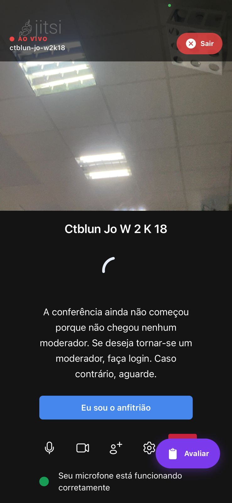
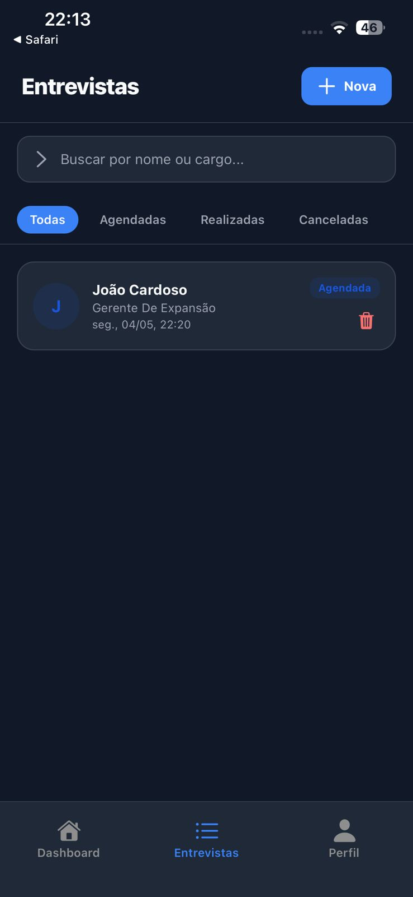
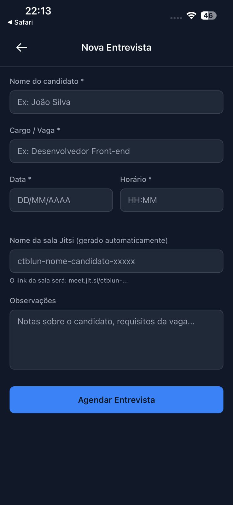
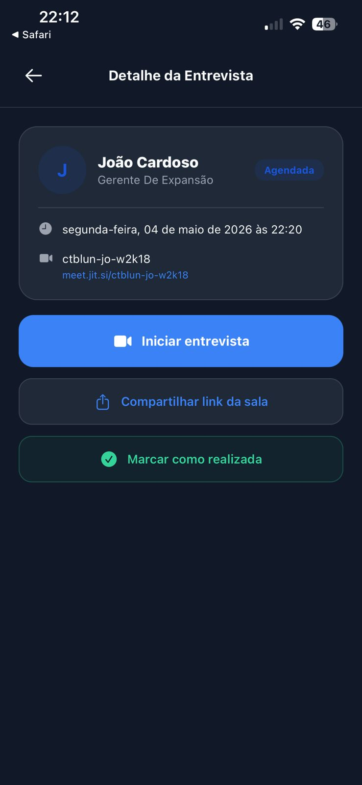

# ctBlun — Assistente de Recrutador

> Assistente inteligente para entrevistas, com ScoreCard privado e anotações em tempo real.

---

## 🔗 Link de Pré-visualização

[▶ Acessar o App](https://manus.im/app-preview/GMG6b67UfeE7ktUcgt4GFB?sessionId=h2QLyAU74CsWeKGaLJXSEJ)

---

## 📱 Preview / QR Code

> Insira aqui o QR Code gerado pela Manus AI para facilitar o acesso ao app.

---

## 💡 Proposta de Valor

O **ctBlun** é único porque oferece total autonomia ao recrutador durante o processo seletivo. Integrado via **SDK do Jitsi**, o app disponibiliza um **ScoreCard privado** de fácil acesso diretamente durante a chamada de vídeo, sem interromper o fluxo da entrevista.

Com foco em **produtividade e nicho profissional**, o ctBlun transforma a experiência do recrutador ao centralizar anotações, observações e critérios de avaliação em um único lugar — tudo de forma discreta e eficiente.

---

## 🎯 Funcionalidades

- **Anotações em tempo real** durante a entrevista, sem sair da chamada
- **ScoreCard privado** visível apenas para o recrutador
- **Anexo de observações** para cada candidato
- **Checklist de requisitos** para manter a entrevista fluida e estruturada
- **Interface discreta** integrada ao ambiente da videochamada via SDK Jitsi

---

## 📸 Capturas de Tela

### Sala de Videoconferência — Jitsi Meet integrado

### Lista de Entrevistas Agendadas

### Agendamento de Nova Entrevista

### Perfil do Recrutador

### Detalhe da Entrevista

---

## 📖 Instruções de Uso

1. Acesse o link de pré-visualização ou escaneie o QR Code
2. Faça login com sua conta de recrutador
3. Na aba **Entrevistas**, clique em **+ Nova** para agendar uma entrevista
4. Preencha o nome do candidato, cargo, data, horário e observações — a sala Jitsi é gerada automaticamente
5. Acesse o **Detalhe da Entrevista** e clique em **Iniciar entrevista** para entrar na chamada
6. Durante a chamada, utilize o painel do **ctBlun** para anotar observações e preencher o ScoreCard em tempo real
7. Ao finalizar, clique em **Marcar como realizada** e consulte o resumo no seu **Perfil**

---

[← Voltar ao Início](https://github.com/Cawa44/portfolio-cauansantospatti)
