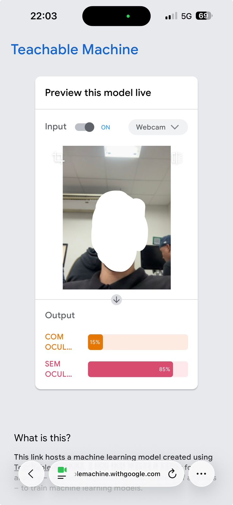

# Engenharia de Prompt e Aplicações em IA
## Laboratório de Classificação Visual & Memorial de Ética em IA

**Integrante:**
- Cauan Santos Patti

---

## 1. Objetivos da Atividade

- **Análise Crítica:** Compreender na prática como dados de treinamento enviesados corrompem a lógica de um modelo de classificação visual, gerando resultados distorcidos e injustos.
- **Aprender a Aprender:** Desenvolver consciência ética sobre o impacto humano e social de sistemas de IA mal curados, propondo intervenções concretas para mitigação do viés.

---

## 2. A Tarefa

### Parte 1 — Laboratório de Classificação Visual

Utilizando o **Teachable Machine (Google)**, foi realizado o treinamento de um modelo de imagem simples com as seguintes etapas:

1. **Definição de Categorias:** Foram criadas duas classes de classificação:
   - **COM OCUL...** (Com Óculos)
   - **SEM OCUL...** (Sem Óculos)

2. **Alimentação de Dados (Dataset Enviesado):** Foram capturadas 20 imagens para cada categoria, utilizando deliberadamente critérios estereotipados e limitados — apenas um padrão dominante por classe, sem diversidade de ângulos, iluminação ou características físicas variadas.

3. **Teste de Inferência:** A câmera foi apontada para um colega que não se encaixava nos padrões capturados durante o treinamento.

4. **Registro do Erro:** O print abaixo registra o momento exato em que o modelo realizou uma classificação incorreta devido ao viés dos dados de treinamento.

---

### Evidência Visual — Falha de Classificação

> O modelo classificou a imagem como **SEM OCUL... com 85% de confiança** e **COM OCUL... com apenas 15%**, apesar de o sujeito apresentar características que deveriam acionar a categoria oposta. O erro evidencia a fragilidade do modelo diante de padrões não representados no treinamento.

---

## 3. Protocolo de Execução

| Etapa | Ação Realizada |
|---|---|
| Acesso à plataforma | Teachable Machine via navegador mobile |
| Categorias criadas | COM OCUL... / SEM OCUL... |
| Imagens por categoria | 20 imagens cada |
| Critério de enviesamento | Padrão único dominante por classe |
| Teste de inferência | Colega fora do padrão treinado |
| Resultado obtido | Classificação incorreta com alta confiança (85%) |

---

## 4. Parte 2 — Memorial de Impacto e Ética

*(Respostas redigidas com verbos no presente do indicativo)*

### Mecanismo do Viés

A seleção restrita de dados limita toda a diversidade de exemplos que o algoritmo analisa. Quando o treinamento possui apenas um padrão dominante, o modelo associa características de forma incompleta e as trata como se fossem universais. Essa distorção corrompe a lógica interna do algoritmo, que passa a reconhecer apenas o que foi repetido no dataset, ignorando variações legítimas da realidade.

### Consequência Social

Quando o sistema realiza uma classificação incorreta, ele ignora características individuais e produz efeitos prejudiciais tanto para a identidade da pessoa quanto para a forma como ela se enxerga. No âmbito profissional, o sistema pode não identificar corretamente o indivíduo, gerando exclusão, invisibilização e impactos diretos em processos seletivos, de acesso ou de reconhecimento.

### Ação Mitigadora

Para garantir maior equidade, propõe-se uma intervenção de **Human-in-the-loop** que: (1) exige a captura de imagens com maior qualidade e diversidade antes de qualquer implementação; (2) inclui uma etapa de revisão humana dos exemplos de treinamento, removendo padrões que reforcem estereótipos; (3) utiliza exemplos recentes e representativos de diferentes grupos; e (4) realiza auditorias periódicas dos dados para corrigir erros e garantir equilíbrio nas distribuições de classe antes da implantação definitiva do modelo.

---

## 5. Critérios de Entrega Atendidos

- **Evidência Visual:** Print do modelo apresentando a falha de classificação — ✅ incluído
- **Texto da Parte 2:** Respostas dentro do limite de 300 palavras, com verbos no presente do indicativo — ✅ atendido
- **Relação técnica-humana:** Conexão explícita entre o dado técnico e o impacto social — ✅ atendido

[← Voltar ao Início](https://github.com/Cawa44/portfolio-cauansantospatti)
